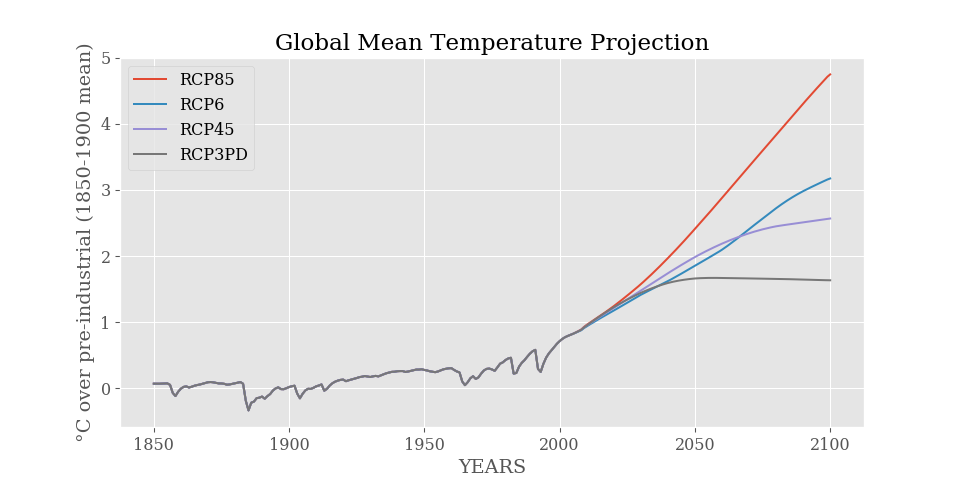

Pymagicc
========

.. include:: ../README.rst
    :start-after: sec-begin-index
    :end-before: sec-end-index

.. include:: ../README.rst
    :start-after: sec-begin-license
    :end-before: sec-end-license

.. toctree::
    :maxdepth: 2
    :caption: Documentation

    installation
    usage
    magicc_variables
    file_conventions
    magicc_flags
    development

.. toctree::
    :maxdepth: 2
    :caption: API reference

    pymagicc
    pymagicc.core
    pymagicc.io
    pymagicc.definitions
    pymagicc.config
    pymagicc.magicc_time
    pymagicc.utils

.. toctree::
    :maxdepth: 2
    :caption: Versions

    changelog
